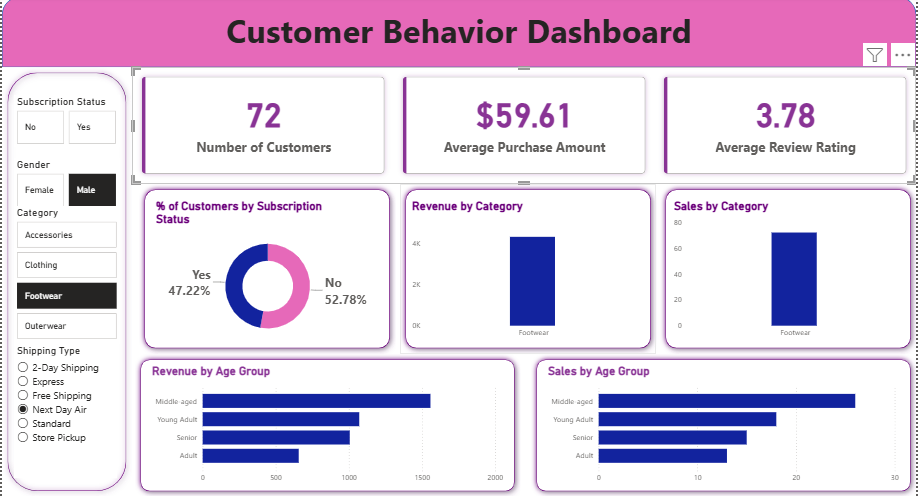

# 🛍️ Customer Shopping Behavior Analysis

## 📌 Overview

This project analyzes customer shopping behavior using Python, PostgreSQL, and Power BI to uncover actionable business insights. The analysis focuses on customer demographics, purchasing patterns, subscription impact, shipping preferences, and product performance.

The project follows a complete data analytics workflow, from data preprocessing and exploratory analysis to SQL-based business analysis and interactive dashboard development.

---

## 📂 Dataset

* **Dataset Name:** Customer Shopping Behavior Dataset
* **Total Records:** 3,900 customer purchase transactions
* **Total Features:** 18 columns
* **Data Includes:**

  * Customer demographics
  * Purchase amount
  * Product categories
  * Shipping preferences
  * Subscription status
  * Review ratings
  * Discount usage

The dataset contains only 37 missing values in the *Review Rating* column, which were handled during data preprocessing.

---

## 🛠️ Tools & Technologies Used

| Tool                 | Purpose                                     |
| -------------------- | ------------------------------------------- |
| Python               | Data cleaning and exploratory data analysis |
| Pandas & NumPy       | Data manipulation and preprocessing         |
| Matplotlib & Seaborn | Data visualization                          |
| PostgreSQL           | Data storage and SQL analysis               |
| SQL                  | Business query analysis                     |
| Power BI             | Interactive dashboard creation              |
| Gamma AI             | Presentation generation                     |
| Microsoft Excel      | Initial data storage                        |

---

## 🔄 Project Workflow

### 1. Data Loading

* Imported the dataset using Pandas.
* Performed initial data inspection and summary statistics.

### 2. Data Cleaning

* Identified missing values and inconsistencies.
* Imputed missing values in the **Review Rating** column using median values.
* Ensured data quality for further analysis.

### 3. Feature Engineering

* Created additional features such as:

  * Age Groups
  * Purchase Frequency Segments

### 4. Exploratory Data Analysis (EDA)

* Analyzed customer demographics and purchase behavior.
* Explored spending patterns across different customer segments.
* Visualized trends and relationships within the dataset.

### 5. SQL Analysis using PostgreSQL

* Imported cleaned data into PostgreSQL.
* Executed SQL queries to answer key business questions related to:

  * Revenue by gender
  * High-value discount users
  * Subscription impact
  * Customer segmentation
  * Product performance

### 6. Dashboard Development

* Developed an interactive Power BI dashboard featuring:

  * Revenue analysis
  * Customer segmentation
  * Product insights
  * Subscription analysis
  * Shipping preference analysis

### 7. Reporting & Presentation

* Documented key findings in a detailed report.
* Created a business presentation using Gamma AI.

---

## 📊 Dashboard Highlights

The Power BI dashboard provides insights into:

* Revenue contribution by gender
* Top-rated products
* Impact of shipping preferences on purchase amount
* Subscription vs non-subscription spending behavior
* Customer segmentation analysis
* High-value discount user identification

<h2>📊 Dashboard</h2>

<p align="center">
  
</p>

---

## 🔍 Key Insights

* Female customers generate slightly higher revenue compared to male customers.
* Customers choosing **Express Shipping** spend approximately **12% more** per transaction.
* Subscription customers contribute significantly higher revenue and demonstrate stronger loyalty.
* Products such as **Blouse**, **Dress**, and **Shirt** receive the highest customer ratings.
* A large portion of customers are new buyers, highlighting opportunities for retention strategies.

---

## 💡 Business Recommendations

* Promote subscription programs to increase customer retention.
* Implement loyalty programs to convert new customers into repeat buyers.
* Target premium customers with personalized offers and discounts.
* Focus marketing efforts on high-performing customer segments.
* Highlight top-rated products in promotional campaigns.

---

## ▶️ How to Run the Project

### Clone the Repository

```bash
git clone <repository_link>
```

### Install Required Libraries

```bash
pip install pandas numpy matplotlib seaborn psycopg2
```

### Run the Analysis

1. Open and execute the Python/Jupyter Notebook for data cleaning and EDA.
2. Import the cleaned dataset into PostgreSQL.
3. Run the SQL scripts provided in the repository.
4. Open the Power BI (.pbix) file to explore the dashboard.
5. Review the report and presentation for detailed insights.

---

## 📁 Project Structure

```text
Customer-Shopping-Behavior-Analysis/
│
├── data/
├── notebooks/
├── sql_queries/
├── dashboard/
├── reports/
├── presentation/
├── images/
└── README.md
```

---

## 👨‍💻 Author

**Rohan Tomar**

Aspiring Data Analyst | SQL | Python | Power BI | PostgreSQL
